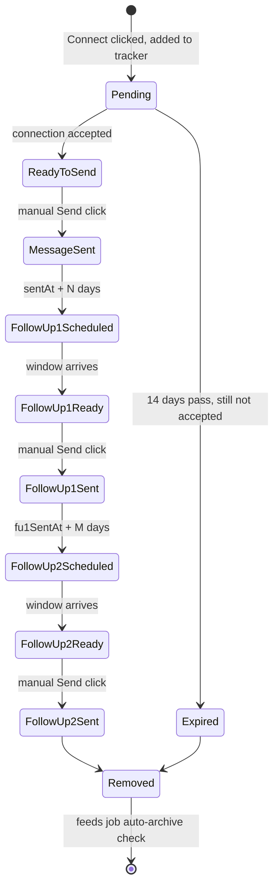
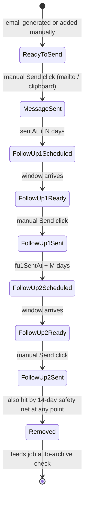

# LinkedIn Referral Outreach Tracker — PRD

**Status:** Draft v2 — incorporates your Aug 9 clarifications, still a living document
**Last updated:** August 10, 2026
**Scope:** Personal-use tool (extension vs. standalone app — open decision, see §11.5), single user, local-first

---

## What changed in v2

Everything below is fully merged into the doc, but as a map back to your numbered clarifications:

1. Follow-up delays confirmed (configurable, 5/7-day defaults) — no structural change.
2. Send window confirmed as a 9:00–10:00am window.
3. **Sending is manual-trigger in v1** for all three stages — a button click opens the profile, pastes the message, and clicks send. No autonomous background sending in v1 (moved to v2 roadmap).
4. Follow-up templates: global defaults **with per-job override**, in scope now.
5/6. Adding a LinkedIn contact is now triggered by clicking LinkedIn's own **Connect** button, with a quick-pick of your 3 most-recent companies + fuzzy search.
7. Big one: **dual-channel contacts** (LinkedIn + manually-added/generated Email, tracked separately per job), **auto-archive** when a job has no active contacts left, **email-permutation tool pulled into v1 scope**, and a new **Received Referral** dashboard section.
8. `dailySendCap` is a soft warning, not an enforced block.
9. **Extension vs. standalone app** — open decision, pros/cons laid out in §11.5, you're leaning standalone.
10. **Google Sign-In** added as a v1 requirement.
11. ATS auto-detect on known career-site platforms + manual fallback via the toolbar icon; company picker (top 3 + fuzzy search) when adding LinkedIn contacts.
12. Email tool moved from Phase 3 into the current phase. All three send stages stay manual-click in v1, but the schema stays extensible for v2 automation.

---

## Contents
1. [Summary](#1-summary)
2. [Problem statement](#2-problem-statement)
3. [Goals (v1)](#3-goals-v1)
4. [Out of scope (v1)](#4-out-of-scope-v1)
5. [Platform risk — read once](#5-platform-risk--read-once)
6. [Data model](#6-data-model)
7. [User flows](#7-user-flows)
8. [Feature specifications](#8-feature-specifications)
9. [Email channel & permutation/generator tool](#9-email-channel--permutationgenerator-tool)
10. [Dashboard](#10-dashboard)
11. [Technical architecture](#11-technical-architecture)
12. [Send cycle — v1 manual-trigger engine](#12-send-cycle--v1-manual-trigger-engine)
13. [Rate-limit & lifecycle defaults](#13-rate-limit--lifecycle-defaults)
14. [Assumptions & open questions](#14-assumptions--open-questions)
15. [Roadmap](#15-roadmap)
16. [Glossary](#16-glossary)
17. [Sources consulted](#17-sources-consulted)

---

## 1. Summary

A tool that turns your LinkedIn referral outreach from "sticky notes in your head" into a tracked pipeline: log a job posting in one click, log the people you've connection-requested for it (or manually add/generate email addresses for people you'll reach out to directly), write one referral-ask message per job per channel, and — when you click Send — have it personalized and delivered (LinkedIn: opened, pasted, and sent in a new tab; Email: handed to your mail client). Everything is reviewable and cancellable before it goes out. A configurable two-stage follow-up cadence runs afterward, and the tool notifies you when it's time to act. A job auto-archives once every contact tied to it has run its course, and you can mark **Received Referral** on any job the moment one actually lands.

## 2. Problem statement

Today, the referral workflow is manual and leaky:
- You apply to a job, then separately go find people at that company — some you connection-request on LinkedIn, others you'd rather email directly — and there's no shared system tracking either.
- By the time people accept (hours to days later), you've often forgotten which job posting prompted the request, or what you meant to say to them.
- There's no reminder to follow up, so warm accepted connections (or unanswered emails) go cold.
- There's no single place to see "who have I already asked, for what, through which channel, and what's the status" — and no way to mark "got the referral" and move on.

## 3. Goals (v1)

- Never lose the link between a job posting and the people you've reached out to for it, across **both** channels.
- Track two parallel outreach channels per job — **LinkedIn profiles** and **manually-added or generated email addresses** — each with its own lifecycle, sharing the same follow-up configuration.
- Write one referral-ask message per job (per channel), highlighting relevant experience from the JD, auto-personalized with each person's first name.
- Follow-up templates default to **global** settings, with an optional **per-job override** for either stage.
- See every message before it's sent, and cancel any queued/scheduled item at any time before it fires — **Launch Control**.
- **v1 sending is manual-trigger, not autonomous**, for all three stages (referral-ask, Follow-up 1, Follow-up 2) on both channels: a background process detects acceptances, computes when things are due, and surfaces "ready to send" items — preferentially during your configured 9–10am window, since that's when people actually check LinkedIn/email — but nothing sends until you click. For LinkedIn, clicking opens the profile in a new tab, pastes the message, and clicks Send. For Email, clicking hands the assembled message to your mail client; you still hit send yourself there.
- Auto-expire stale contacts: LinkedIn — 14 days from connection request if still not accepted; Email — same 14-day clock, from the first email sent (mostly a safety net, since default follow-ups complete in ~12 days). Both configurable.
- **Auto-archive a job** the moment every contact tied to it (either channel) has resolved — expired, fully cycled, or removed — and none remain active.
- **Received Referral**: a button on any job moves it out of the active pipeline into its own dashboard section, the moment a referral actually comes through.
- Every click of LinkedIn's native **Connect** button prompts adding that person to the tracker — quick-pick your 3 most-recently-added companies, or fuzzy-search any tracked company.
- Auto-detect known ATS job-posting pages (Greenhouse, Lever, Workday, SmartRecruiters, iCIMS, Ashby, Taleo, and others) and prompt Add-to-Tracker; manual fallback (via the toolbar icon) for anything not auto-detected.
- **Email-permutation/generator tool is in v1 scope** — generate ranked candidate addresses per company, add manually or from the generated list, same tracked lifecycle and follow-up notifications as LinkedIn contacts.
- **Google Sign-In** gates access.
- `dailySendCap` is a soft warning shown in the UI, not a hard block.
- One dashboard to configure everything and see the state of every job / contact / message, across both channels.

## 4. Out of scope (v1)

- **Auto-sending the connection request itself.** Still a manual, human-paced action — see §5. The extension picks up *after* you've already clicked Connect.
- **Autonomous/unattended sending** — i.e., the background loop firing a message on its own without a click. This *was* the v1 design in the previous draft; per your Point 3/12 it's now a **v2** feature (§15). v1 requires a manual click for every send, on both channels, at every stage.
- **Actually sending your emails.** The tool tracks, generates addresses, assembles messages, and reminds you — but hitting Send in your mail client is on you.
- Multi-user / team use, hosted accounts, cross-device sync — still out for now, though this may need revisiting depending on how §11.5 (extension vs. standalone) shakes out.

## 5. Platform risk — read once

LinkedIn's User Agreement (Section 8.2) and Help Center explicitly name browser extensions and bots that automate connecting or messaging as prohibited — regardless of whether the tool is doing something you could have done manually. Practically, this is a contract matter between you and LinkedIn, not a legal one: the consequence is account-level (a temporary restriction on invites/messages, or in worse cases a ban), not a lawsuit. Enforcement has gotten more aggressive through 2026, and it's reportedly driven more by *behavior pattern* — volume, timing regularity, how "non-human" a session looks — than by simply detecting that an action was automated.

Design choices in this doc that manage that risk (not eliminate it — nothing here makes the tool ToS-compliant):

- **Connection requests stay manual.** You decide who to invite and when, one at a time. This is also the single biggest lever, since invite-spam is what LinkedIn's detection is most tuned for.
- **v1 sends require a click, every time, for every stage.** This is actually a step *more* human-paced than the original opportunistic-background design — nothing fires without you physically pressing Send in Launch Control first.
- **Conservative defaults everywhere**: a suggested daily send count, randomized delays reserved for when v2 automation lands, a restricted send window, and a mandatory human review step (Launch Control).
- **You're always one click from cancelling anything queued.**
- One honest trade-off to flag: per your Point 8, `dailySendCap` is now a **warning, not an enforced limit**. Since v1 sending is already manual-click, this mostly just means the UI won't stop you from clicking Send past the suggested daily count — it'll just tell you you're past it. Small increase in risk versus a hard stop, and entirely your call per the "dial, not a rule" framing below.

Treat every "default" number in this doc as a dial, not a rule — they're deliberately conservative starting points, and you're the one deciding how much risk to take with your own account.

## 6. Data model

Two contact channels roll up under each job now — think of it as `JobPosting → { linkedinContacts[], emailContacts[] }`, modeled below as one `Contact` type discriminated by `channel` so querying/filtering stays simple as the number of jobs grows.

```typescript
interface JobPosting {
  id: string;                    // uuid, primary key
  jobLink: string;                // canonical URL — the "map key" you described
  sourceType: 'EASY_APPLY' | 'COMPANY_SITE';
  companyName: string;            // display name, editable
  companyLinkedInSlug?: string;   // e.g. "microsoft" — captured from the job's linked
                                   // company page, used to reliably filter LinkedIn's
                                   // People search by "Current company" later
  jobTitle: string;
  companyJobId?: string;          // ATS requisition ID, for COMPANY_SITE postings — see §8.1
  companyApplyUrl?: string;       // if different from jobLink
  dateAdded: string;               // ISO 8601 datetime
  status: 'ACTIVE' | 'ARCHIVED' | 'CLOSED' | 'REFERRAL_RECEIVED';
  archiveReason?: 'MANUAL' | 'AUTO_NO_ACTIVE_CONTACTS';
  referralReceivedAt?: string;

  referralMessageTemplate: string;   // LinkedIn referral-ask body — NO greeting line, see §8.2
  emailMessageTemplate?: string;     // Email referral-ask body — see note below
  emailSubjectTemplate?: string;     // Email needs a subject line LinkedIn doesn't — see note below

  followUp1TemplateOverride?: string; // unset = inherit GlobalSettings.followUp1Template
  followUp2TemplateOverride?: string; // unset = inherit GlobalSettings.followUp2Template
}

type ContactChannel = 'LINKEDIN' | 'EMAIL';

interface Contact {
  id: string;
  jobPostingId: string;           // FK -> JobPosting.id
  channel: ContactChannel;
  firstName: string;               // always user-editable (see edge cases §8.1)

  // ---- LinkedIn-only (channel === 'LINKEDIN') ----
  linkedinProfileUrl?: string;
  fullNameRaw?: string;            // as scraped from LinkedIn
  connectionRequestSentAt?: string; // captured the moment you click LinkedIn's own Connect button
  connectionStatus?: 'PENDING' | 'ACCEPTED' | 'EXPIRED' | 'DECLINED_OR_REMOVED';

  // ---- Email-only (channel === 'EMAIL') ----
  emailAddress?: string;
  emailSource?: 'GENERATED' | 'MANUAL';  // from the permutation tool, or pasted in by hand
  emailAddedAt?: string;                  // informational only — expiry runs from outreachMessageSentAt, not this

  // ---- Shared across both channels ----
  outreachMessageStatus: 'QUEUED' | 'READY_TO_SEND' | 'SENT' | 'EXPIRED' | 'CANCELLED_BY_USER';
  outreachMessageSentAt?: string;

  followUp1Status: 'NOT_SCHEDULED' | 'SCHEDULED' | 'READY_TO_SEND' | 'SENT' | 'SKIPPED' | 'CANCELLED_BY_USER';
  followUp1ScheduledFor?: string;
  followUp1SentAt?: string;

  followUp2Status: 'NOT_SCHEDULED' | 'SCHEDULED' | 'READY_TO_SEND' | 'SENT' | 'SKIPPED' | 'CANCELLED_BY_USER';
  followUp2ScheduledFor?: string;
  followUp2SentAt?: string;

  removedAt?: string;   // set the moment this contact has nothing left to do — expired, fully
                         // cycled, or declined — moves it to History and feeds the auto-archive check
}

interface GlobalSettings {
  contactExpiryDays: number;             // default 14 — LinkedIn: days since connectionRequestSentAt
                                           // while PENDING; Email: days since outreachMessageSentAt
  followUp1DelayDays: number;            // default 5, from outreachMessageSentAt (both channels)
  followUp2DelayDays: number;            // default 7, from followUp1SentAt (both channels)
  sendWindowStart: string;               // "09:00"
  sendWindowEnd: string;                 // "10:00"
  activeDays: number[];                  // [1,2,3,4,5] Mon–Fri, default; configurable
  greetingFormat: string;                // e.g. "Hi {{firstName}},"
  followUp1Template: string;             // global default, body only
  followUp2Template: string;             // global default, body only
  dailySendCap: number;                  // suggested default 15 — soft warning only, see §5/§13
  interMessageDelaySeconds: [number, number]; // reserved for v2's autonomous engine — unused by v1's manual-click flow
}

interface UserAccount {
  googleId: string;
  email: string;
  displayName?: string;
  signedInAt: string;
}
```

A few notes on fields that aren't obvious:
- `companyLinkedInSlug` is the difference between "search People filtered by a free-text company name" (fuzzy, misses variants) and "search filtered by LinkedIn's own company entity" (exact). Captured automatically when available.
- `emailMessageTemplate` / `emailSubjectTemplate` are my addition — email is a different medium than a LinkedIn note (it needs a subject, and isn't bound by LinkedIn's connection-note length), so I split it from `referralMessageTemplate` rather than reusing one body across both channels. Flagged in §14 — say the word if you'd rather share a single template.
- `removedAt` is new: a single "this contact is done" marker, set whenever any terminal state hits (expired, declined, or FU2 fully resolved). It's what the auto-archive check (§7.7/§8.9) and History filter both key off of, instead of having to reason about five separate status enums each time.
- Every `*At` field is a full datetime, not just a date — needed for the send-window math.
- `DECLINED_OR_REMOVED` exists because a LinkedIn connection can be accepted and later removed, or a request can sit and then get ignored/removed from their end.
- Email contacts skip the LinkedIn-style "PENDING acceptance" phase entirely — there's no equivalent gate, so an email `Contact` goes straight to `outreachMessageStatus: 'READY_TO_SEND'` the moment an address exists (generated or typed in).

## 7. User flows

### 7.1 Add a job to the tracker
1. You're on a LinkedIn job posting, **or** on a known ATS career-site page (Greenhouse, Lever, Workday, SmartRecruiters, iCIMS, Ashby, Taleo, or others matched by pattern — see §8.1). Extension injects an **"Add to Tracker"** button when it recognizes the page.
2. Extension auto-detects `EASY_APPLY` vs `COMPANY_SITE` on LinkedIn (presence of LinkedIn's Easy Apply button vs an external "Apply" redirect); on a recognized ATS page it's `COMPANY_SITE` by definition.
3. Auto-captures `jobTitle`, `companyName`, `companyLinkedInSlug` (LinkedIn only), `jobLink`, and — on a matched ATS page — attempts `companyJobId` from the URL pattern (§8.1).
4. **If the page isn't auto-recognized** (an arbitrary company career site the regex table doesn't cover): no auto-inject. Click the extension's **toolbar icon** instead → "Add current page to Tracker" → the current tab's URL is pre-filled, everything else typed in manually.
5. You confirm/edit the captured fields and save. Job appears in the dashboard as `ACTIVE`.

### 7.2 Add a LinkedIn contact to a job's referral queue
1. On someone's LinkedIn profile, you click **LinkedIn's own Connect button** — the extension listens for this native action rather than requiring a separate custom button.
2. A popup appears immediately: pick the job this person is for. It quick-picks your **3 most-recently-added companies** (by `dateAdded` on their job postings) as one-tap options. Not one of the three? A **fuzzy-search** field searches every tracked `ACTIVE` job's `companyName`.
3. If the chosen company has more than one `ACTIVE` job posting tracked, a short secondary list lets you pick the specific posting.
4. Popup confirms parsed `firstName` (editable) and `connectionRequestSentAt` (defaults to now, editable for backfilling).
5. If this profile is already queued under a *different* job, extension flags it ("Already messaged for [Job A] — also add to [Job B]?").
6. Saved as a `Contact` with `channel: 'LINKEDIN'`, `connectionStatus: 'PENDING'`, `outreachMessageStatus: 'QUEUED'`.
7. A manual "Add to Referral Queue" entry point (from the profile page or toolbar icon) stays available too, for backfilling connections you sent before installing the tool or that the Connect-click popup missed.

### 7.2b Add an email contact to a job (new)
1. In the dashboard, open a job → it now has two tabs: **LinkedIn** and **Emails**, matching the split you asked for.
2. Under **Emails**, add a contact two ways: **paste manually** (name + address), or **Generate** — opens the email-permutation tool (§9) pre-filled with the job's company/domain; pick from ranked candidates, optionally paste one confirmed real address first to lock in that company's actual pattern.
3. Saved as a `Contact` with `channel: 'EMAIL'`, `emailSource: 'GENERATED' | 'MANUAL'`, `outreachMessageStatus: 'READY_TO_SEND'` — no acceptance gate, it's ready as soon as you have an address.

### 7.3 Write & queue the referral-ask message
1. In the dashboard, open a job → **Message** tab, now split by channel.
2. Write `referralMessageTemplate` (LinkedIn body — no greeting line, system-generated per person) and, separately, `emailMessageTemplate` + `emailSubjectTemplate` (Email).
3. Follow-up templates default to the two global generics in Settings; override either one per-job via `followUp1TemplateOverride` / `followUp2TemplateOverride` if this job needs different follow-up copy — leave blank to inherit the global template.
4. Live preview shows the assembled message for every queued/ready contact under that job, per channel — greeting + blank line + template, real first name substituted. Nothing commits until you're looking at the real, personalized text for every person.

### 7.4 Launch Control — review, cancel, and manually send
1. Dashboard → **Launch Control**: one table across all jobs and **both channels**, every queued/ready/scheduled item.
2. Columns: Job, Contact, **Channel**, Stage (Referral Ask / Follow-up 1 / Follow-up 2), Status, expandable Message Preview, Actions.
3. Items whose `ready`/`scheduledFor` time falls inside today's configured send window are surfaced/sorted to the top — that's when people are actually checking LinkedIn/email — but every stage requires your click; nothing here fires on its own in v1.
4. Actions per row:
   - **Send** — for LinkedIn: opens the profile in a new tab, pastes the assembled message, clicks LinkedIn's own Send. For Email: hands the assembled subject+body to your mail client (mailto:, with clipboard-copy as a fallback) — you still hit send yourself there.
   - **Cancel** — removes from queue, sets status to `CANCELLED_BY_USER`, never sent.
   - **Edit** — override the message for just this person.
   - **Snooze**.
5. A soft warning banner appears if today's sends are at or past `dailySendCap` — informational only, doesn't block further sends (§5, §13).
6. Cancelling is always available up until the moment you actually click Send.

### 7.5 Housekeeping (automatic, read-only — separate from sending)
1. A background process — safe to run automatically since it only reads and does local bookkeeping, never writes to LinkedIn — periodically checks status: fetches your 1st-degree connections and diffs against `PENDING` LinkedIn contacts to detect acceptance, checks both channels' expiry clocks, computes and rolls forward follow-up due dates, and evaluates the auto-archive rule (§7.7).
2. When a check flips an item to "ready" (accepted on LinkedIn, or a follow-up's scheduled time has arrived), it moves to `READY_TO_SEND` in Launch Control and, for email specifically, raises a notification (§8.7) — but it does **not** send anything itself. See §12 for the full split between housekeeping and the manual send action.

### 7.6 Follow-up cadence
1. The moment a referral-ask message sends (either channel), `followUp1ScheduledFor` is set to `outreachMessageSentAt + followUp1DelayDays`, rolled forward to the next valid send-window slot if it lands outside one (e.g., weekend → next Monday morning).
2. When that time arrives, Follow-up 1 becomes `READY_TO_SEND` in Launch Control, using the job's `followUp1TemplateOverride` if set, otherwise the global `followUp1Template` — same assembly rule, waiting on your click.
3. `followUp2ScheduledFor` is set the same way, relative to `followUp1SentAt`; same override-then-global lookup for the template.
4. If a job is marked `ARCHIVED`/`CLOSED` in the dashboard, you're prompted to cancel all pending queue items for it — same prompt used by Received Referral (§7.8).

### 7.7 Expiry handling & auto-archive
1. **LinkedIn**: if a `Contact` is still `PENDING` after `contactExpiryDays` (default 14) from `connectionRequestSentAt`, it's set to `EXPIRED`, `removedAt` is set, and it drops from the active queue.
2. **Email**: the same 14-day clock applies, counted from `outreachMessageSentAt` (the first email sent) rather than from acceptance, since there's no acceptance step for email. In practice this mostly acts as a safety net — the default 5+7 = 12-day follow-up cadence usually completes inside that window — but it catches contacts whose schedule got pushed out (e.g., a weekend roll-forward) or where a follow-up was skipped.
3. Expired items don't vanish silently — they move to a visible **History** list (filterable), so you can still see "I reached out to 10 people, 6 accepted, 4 expired" later.
4. **Auto-archive (new)**: every time housekeeping runs, for each `ACTIVE` job it checks whether *every* `Contact` under it (both channels) now has `removedAt` set — i.e., nothing left `PENDING`, `ACCEPTED`, `QUEUED`, `READY_TO_SEND`, or `SCHEDULED`. If so, the job auto-transitions to `ARCHIVED` with `archiveReason: 'AUTO_NO_ACTIVE_CONTACTS'`. `REFERRAL_RECEIVED` jobs are excluded from this check — they've already been manually resolved.

### 7.8 Received Referral (new)
1. From any job's page, click **Received Referral**.
2. Same "cancel remaining pending items?" prompt used when archiving — confirms before cancelling anything still queued/scheduled for that job.
3. Job status → `REFERRAL_RECEIVED`, `referralReceivedAt` is set, and the job moves into its own **Referral Received** dashboard section (§10) — separate from both the active Jobs list and Archived/History.

## 8. Feature specifications

### 8.1 Add to Tracker: Easy Apply vs Company Site vs unrecognized

| | Easy Apply | Company Site (recognized ATS) | Company Site (unrecognized) |
|---|---|---|---|
| `jobLink` | The LinkedIn posting URL | The company's own posting URL | The current tab's URL |
| `companyJobId` | Not applicable | Extracted via ATS URL pattern (table below) | Manual entry only |
| Capture method | Fully automatic from the LinkedIn DOM | Auto-detected on page load, "Add to Tracker" prompt injected | No auto-inject — click the extension's toolbar icon → "Add current page to Tracker" → manual form |

Common ATS URL shapes to pattern-match against (starting point — these shift, extend as you hit new ones):

| ATS | Typical URL shape | Job ID location |
|---|---|---|
| Greenhouse | `boards.greenhouse.io/{company}/jobs/{digits}` | Trailing numeric ID |
| Lever | `jobs.lever.co/{company}/{uuid}` | Trailing UUID |
| Workday | `{company}.wd1.myworkdayjobs.com/…/job/…/{REQ-code}` | Requisition code, often `R-` or `JR-` prefixed |
| SmartRecruiters | `jobs.smartrecruiters.com/{company}/{digits}-{slug}` | Leading numeric ID |
| iCIMS | `{company}.icims.com/jobs/{digits}/{slug}/job` | Numeric ID in path |
| Ashby | `jobs.ashbyhq.com/{company}/{uuid}` | Trailing UUID |
| Taleo | `…taleo.net/careersection/…/jobdetail.ftl?job={code}` | Query-string `job` param |

**Name-parsing edge case:** LinkedIn display names routinely include credentials, pronouns, or emoji ("Jane Smith, MBA ⭐" / "Jane Smith (she/her)"). Auto-parse takes the first whitespace-delimited token as `firstName`, always shown editable at the point of adding the contact *and* in the message preview.

### 8.2 Message assembly rule

Every outbound message = `greetingFormat` (with `{{firstName}}` substituted) + blank line + the relevant body template. LinkedIn messages have no subject; Email messages additionally assemble a subject line from `emailSubjectTemplate`. You write only the body (and, for email, the subject); the greeting is system-generated and consistent.

```
Hi Bob,

[Your 2–3 line referral ask — what you've worked on that maps to this JD]
```

Follow-up 1 and Follow-up 2 pull from the job's template override if set, otherwise the global generic template in Settings — same assembly rule either way, no per-job customization required unless you want it.

### 8.3 Launch Control panel

Detailed in §7.4. Filters by Job / Stage / Status / **Channel**. Bulk action: cancel all pending items for a given job (used when archiving, closing, or marking Received Referral).

### 8.4 Send cycle

See §12 for the full housekeeping-vs-manual-send split and pseudocode.

### 8.5 Follow-up queue

Same shape as the referral queue (job → people), spanning both channels, populated automatically the moment a referral-ask sends — you don't add people to it manually. Each entry tracks both follow-up stages independently, resolving each stage's template as job-override-then-global.

### 8.6 Send-window / weekday scheduling

Applies uniformly to *all* automated sends — referral-ask, Follow-up 1, and Follow-up 2 — on the reasoning that "people don't check LinkedIn/email much on weekends" applies just as much to the initial ask as to the follow-ups. In v1, this window governs **when items surface as "ready" in Launch Control and when notifications fire** — not an autonomous fire time, since v1 sending is manual-click only (§3, §12). The field-level design (`sendWindowStart/End`, `activeDays`) is kept exactly as-is so v2 can turn on autonomous firing without a schema change. One global window/day-set in v1; splittable per-stage later.

### 8.7 Notifications

Promoted from "suggested, optional" to a real v1 feature, specifically because **email has no other passive surface** the way LinkedIn's Follow-up Queue view does — you asked explicitly for follow-up notifications for email. A badge count on the extension icon / app for "N items ready to send" and a notification the moment a follow-up (either channel) flips to `READY_TO_SEND`, using whatever delay values are currently configured (global default or per-job override). Still cheap to extend to LinkedIn too, just less load-bearing there since Launch Control already surfaces it.

### 8.8 Received Referral

See §7.8 for the flow and §10 for the dashboard section.

### 8.9 Auto-archive

See §7.7 (point 4) for the precise trigger. Manually archiving/closing a job still works exactly as before and is unaffected by this rule.

## 9. Email channel & permutation/generator tool

*(Pulled forward from Phase 3 into the current build — per your Point 12, this is explicitly not deferred anymore.)*

### 9.1 Input / output

**Input:** Full name (or separate First / Middle / Last fields — recommended, since parsing "John F. Kennedy" reliably needs the split anyway), company domain, optional company-size hint.
**Output:** A ranked, de-duplicated list of candidate addresses, grouped into tiers, with a "copy all" / "copy top N" action, or **Add to job** to save one directly as an Email `Contact` (§7.2b).

### 9.2 Normalization (before generating anything)

- Lowercase everything.
- Strip diacritics (é → e, ñ → n) — corporate email systems are almost universally ASCII-only.
- Strip apostrophes (O'Brien → obrien) and treat hyphenated surnames two ways: as one joined token (smithjones) and as first-component-only (smith), since companies handle these inconsistently.
- Drop suffixes (Jr., Sr., III) entirely — essentially never appear in corporate email locals.

### 9.3 Pattern generation

With `first`, `last`, optional `middle`, and initials `f`/`l`/`m`:

```
tier1 = [ first.last, f+last, first+l ]
tier2 = [ first+last, first, f.last, first.l ]
tier3 = [ last.first, l.first, last.f,
          last+first, l+first, last+f,
          f+l, last,
          first_last, first-last ]

IF middle present:
  tierMiddle = [ first.m.last, first+m+last, f+m+last ]
```

**Worked example — simple name, large company (`microsoft.com`, John Doe):**

| Rank | Candidate | Pattern |
|---|---|---|
| 1 | `john.doe@microsoft.com` | first.last |
| 2 | `jdoe@microsoft.com` | first-initial + last, no separator |
| 3 | `johnd@microsoft.com` | first + last-initial |
| 4 | `johndoe@microsoft.com` | first + last |
| 5 | `john@microsoft.com` | first only |
| — | `doe.john@microsoft.com` | last.first — see note below |

**Worked example — middle name, "John F. Kennedy" @ example.com:**

Base tiers as above (`john.kennedy@`, `jkennedy@`, `johnk@`, …) *plus*:

| Candidate | Pattern |
|---|---|
| `john.f.kennedy@example.com` | first.middle-initial.last |
| `johnfkennedy@example.com` | first+middle-initial+last |
| `jfkennedy@example.com` | all-initials+last |

Middle-name variants are consistently rarer in practice than the base tiers — most companies ignore middle names entirely — so they're worth trying only after tiers 1–3 come up empty.

### 9.4 Ranking — what the data actually says

Real-world frequency shifts meaningfully with company size:

| Company size | Dominant pattern |
|---|---|
| Under 10 employees | `first@` alone, by a wide margin |
| ~50–500 employees | `flast@` (first-initial + last, no separator) |
| 500–5,000 | `flast@` and `first.last@` roughly split, with `first.last@` edging ahead toward the top of that range |
| 5,000–10,000+ | `first.last@` clearly dominant |

Microsoft specifically shows up in multiple email-finder databases with `first.last@` as the top or near-top pattern, though the exact percentage varies by data provider — treat the *ranking* as reliable and any single cited *percentage* as approximate.

One correction to an earlier guess of `john.doe` → `j.doe` → `doe.john`: the data supports `john.doe` as #1, but the empirically stronger #2 is `jdoe` (no dot) rather than `j.doe` (with a dot). `doe.john`-style (last-first) patterns are genuinely rare and more of a long-tail guess than a real #3.

### 9.5 The gold-standard approach

Statistics are a fallback. If you ever have **one confirmed real email** from the target company — from a press page, a GitHub commit, a conference bio, or a LinkedIn "Contact info" section someone's made public — infer that company's pattern from it directly and apply it to everyone else there. Individual companies cluster hard on a single dominant pattern (some sources showed one pattern covering 90%+ of a company's addresses), so one confirmed example beats population-wide statistics every time. Surfaced as a first step in the tool's UI ("Got a known email from this company? Paste it here") before falling back to generic ranking — this is also the flow referenced in §7.2b step 2.

## 10. Dashboard

- **Jobs** — list of tracked postings, status, contact counts split by channel (LinkedIn queued / accepted / sent / expired, Email ready / sent / expired).
- **Launch Control** — cross-job, cross-channel queue table from §7.4/§8.3.
- **Follow-up Queue** — same shape, for the two follow-up stages, both channels.
- **Referral Received** — jobs marked via §7.8, kept separate from the active Jobs list.
- **History** — expired/cancelled/auto-archived items, kept visible rather than deleted.
- **Settings** — everything in `GlobalSettings`, plus the two generic follow-up templates. Per-job overrides live on each job's own page, not here.
- **Email Finder** — the permutation/generator tool (§9), now a v1 view, not a Phase 3 placeholder.
- **Sign-in gate** — Google Sign-In (§11.4) required before any of the above shows data.

Where this dashboard actually lives (extension full-page view vs. a standalone app) is still an open decision — see §11.5.

## 11. Technical architecture

**Structure (Manifest V3, for the capture + mechanical-send layer):**
- **Content scripts** on `linkedin.com/*` and the known ATS domains from §8.1 — inject "Add to Tracker" prompts, listen for LinkedIn's native Connect button click, read the DOM to determine connection status, and (only on an explicit Send click) fill and submit LinkedIn's own message composer (simulated typing + click, not a private API call).
- **Background service worker** — owns the housekeeping loop (§7.5, §12): acceptance detection, expiry checks, follow-up scheduling, auto-archive evaluation, notifications. Does **not** send anything on its own in v1 — that's gated behind the manual Send action.
- **Options page / dashboard** — see §11.5 for whether this lives inside the extension or as a standalone app.

### 11.1 Manual send mechanics (§3, §12)

- **LinkedIn**: clicking Send in Launch Control opens the contact's profile in a new tab, waits for the message composer to load, fills it with the assembled message, and clicks LinkedIn's own Send button. Still DOM automation under the hood — same resilience needs as before — but now triggered per click rather than by an autonomous loop.
- **Email**: clicking Send opens a `mailto:` link pre-filled with the recipient, subject, and body; if the mail client/OS doesn't handle a `mailto:` well for longer bodies, falls back to copying the assembled message to the clipboard so you can paste it into Gmail/Outlook yourself. Either way, actually hitting Send inside the mail client is entirely manual — there's no way to automate that leg from a browser extension.

### 11.2 DOM automation resilience

LinkedIn's markup changes often (obfuscated class names in particular). Prefer stable anchors — `aria-label`, visible button text, structural position — over CSS class names, and keep every selector in one central config file so a LinkedIn redesign means editing one place, not hunting through the codebase. This is the single biggest maintenance cost of this category of tool; budget for it.

### 11.3 Connection-status checks

Rather than visiting each queued person's profile individually (slow, more page-loads than necessary), periodically fetch your 1st-degree connections list once per session and diff it in memory against queued LinkedIn contacts. Fewer page visits, faster, smaller footprint. This is read-only and safe to run automatically as part of housekeeping.

### 11.4 Google Sign-In

Added per your Point 10. In the extension, implemented via the `chrome.identity` API; in a standalone app, a standard OAuth 2.0 web flow. **Assumption to confirm (§14):** in v1 this is auth/session-gating only — it identifies *you*, it doesn't imply your data leaves the device. Storage stays local (chrome.storage.local or a local file, per §11.6) either way, unless the standalone-app path in §11.5 later pulls in a small local backend for extension⇄app sync.

### 11.5 Extension vs. standalone app — open decision

Per your Point 9: you're leaning toward a standalone app because the extension's full-page view would get cluttered. Here's the trade-off, since you asked for an opinion — decision deferred, revisit before build starts.

**Option A — Extension only** (dashboard as the extension's own full-page view, `chrome-extension://…/dashboard.html`)
- **Pros:** one codebase, no separate backend or sync layer, zero-network-hop access to `chrome.storage.local`, simplest auth (`chrome.identity` piggybacks off your Chrome profile).
- **Cons:** extension "full tab" views feel cramped next to a real app — limited window chrome, harder to theme, no custom window sizing; big tables/charts (Launch Control, History) are more awkward to build well; tied to Chrome being open and the extension enabled.

**Option B — Standalone app + thin extension** (extension only does capture + mechanical send; a separate app is the dashboard)
- **Pros:** full design freedom for the actual dashboard — routing, layout, resizable windows, proper charts; clean separation between "capture & mechanical send" (extension's job) and "review & configure" (app's job); nicer login UX; easier path to cross-device sync later if you ever want it (Phase 3 in §15).
- **Cons:** two codebases to keep in sync; needs a real sync mechanism between them, since a standalone app **can't read `chrome.storage.local` directly** — the practical path is a small local backend (a lightweight local server or local SQLite file) that both the extension (via native messaging or a local HTTP endpoint) and the app read/write to, replacing `chrome.storage.local` as the single source of truth. That's a genuine added moving part for what's otherwise a single-user local tool — worth being clear-eyed about before committing.

My lean, for what it's worth: if the dashboard UX is the thing bothering you, Option B is the right call long-term, but it's a meaningfully bigger build (that local-backend layer isn't optional, it's the crux of making B work at all). If you want to ship something usable faster and revisit later, Option A first with a "someday split into B" path kept open is the lower-risk sequencing. Either way, the extension's content-script layer (§8.1, §11.1) is needed regardless of which way the dashboard goes.

### 11.6 Storage

`chrome.storage.local` for everything under Option A — jobs, contacts, settings. Default quota is about 10MB (this was 5MB before Chrome 114); the `unlimitedStorage` permission removes that cap entirely if you outgrow it. Even a few hundred jobs with a few dozen contacts each (now across two channels) is well within 10MB — but if it ever gets tight, the migration path is IndexedDB rather than raising the cap indefinitely, since very large `chrome.storage.local` reads/writes slow down. Under Option B, this section gets replaced by whatever local backend the standalone app uses — revisit once §11.5 is decided.

**Permissions:** `storage`, `alarms`, `scripting`, `identity` (for Google Sign-In), host permissions for `*://*.linkedin.com/*` and the ATS domains in §8.1. Optionally `notifications` for §8.7.

## 12. Send cycle — v1 manual-trigger engine

Split into two pieces per §3/§7.5: an automatic, read-only **housekeeping** pass, and a manual, per-click **send action**. Only the second one ever writes to LinkedIn or hands off an email.

```
// ---- HOUSEKEEPING: runs automatically (tab focus / periodic alarm), read-only ----
ON (linkedin_tab_focused OR periodic_alarm OR dashboard_opened):

  connections = fetch_first_degree_connections()   // one batch call, see §11.3

  FOR job IN jobs WHERE status == ACTIVE:

    FOR contact IN job.contacts WHERE channel == LINKEDIN AND connectionStatus == PENDING:
      IF now() - contact.connectionRequestSentAt > settings.contactExpiryDays:
          contact.connectionStatus = EXPIRED
          contact.outreachMessageStatus = EXPIRED
          contact.removedAt = now()
      ELSE IF contact.linkedinProfileUrl IN connections:
          contact.connectionStatus = ACCEPTED
          contact.outreachMessageStatus = READY_TO_SEND   // waits here for a manual Send click

    FOR contact IN job.contacts WHERE channel == EMAIL AND outreachMessageStatus == SENT:
      IF now() - contact.outreachMessageSentAt > settings.contactExpiryDays
         AND contact.followUp2Status IN (SENT, SKIPPED, CANCELLED_BY_USER, NOT_SCHEDULED):
          contact.removedAt = now()   // 14-day safety net, see §7.7

    FOR contact IN job.contacts WHERE followUp1Status == SCHEDULED AND now() >= contact.followUp1ScheduledFor:
      contact.followUp1Status = READY_TO_SEND
      notify("Follow-up 1 ready", contact)   // required for EMAIL, optional/cheap for LINKEDIN — see §8.7

    FOR contact IN job.contacts WHERE followUp2Status == SCHEDULED AND now() >= contact.followUp2ScheduledFor:
      contact.followUp2Status = READY_TO_SEND
      notify("Follow-up 2 ready", contact)

    // Auto-archive check
    IF job.contacts.every(c => c.removedAt is set):
        job.status = ARCHIVED
        job.archiveReason = AUTO_NO_ACTIVE_CONTACTS

  IF count_sent_today() >= settings.dailySendCap:
      show_warning_banner("Past today's suggested send cap")   // advisory only, never blocks — §5, §13


// ---- MANUAL SEND: fires only on an explicit Launch Control click ----
ON user_clicks_send(contact, stage):
  template = resolve_template(job, stage)   // job override if set, else GlobalSettings default
  message = assemble(settings.greetingFormat, contact.firstName, template)

  IF contact.channel == LINKEDIN:
      open_profile_in_new_tab(contact.linkedinProfileUrl)
      paste_into_composer(message)
      click_linkedin_send()
  ELSE:  // EMAIL
      open_mailto(contact.emailAddress, subject, message)  // fallback: copy message to clipboard

  mark_stage_sent(contact, stage, now())
  schedule_next_follow_up(contact, stage)   // sets *ScheduledFor, resolved to next valid window if needed
```

`resolve_template(job, stage)` and `schedule_next_follow_up` both apply `next_valid_window(datetime)`, which rolls a computed timestamp forward to the nearest allowed day + time range (e.g., a delay landing on Saturday 3pm rolls to Monday 9am).

Contact lifecycle, visually — two separate diagrams now, since LinkedIn and Email genuinely diverge (no acceptance gate on the email side):





## 13. Rate-limit & lifecycle defaults

| Setting | Suggested default | Why |
|---|---|---|
| `contactExpiryDays` | 14 | Your spec — LinkedIn counts from `connectionRequestSentAt` while `PENDING`; Email counts from `outreachMessageSentAt` (first email sent) |
| `followUp1DelayDays` | 5 | Long enough to not look impatient, short enough to stay top-of-mind |
| `followUp2DelayDays` | 7 (from FU1) | Same reasoning, slightly longer gap |
| `sendWindowStart` / `End` | 09:00 / 10:00 | Confirmed as a window (Point 2) |
| `activeDays` | Mon–Fri | Your spec |
| `dailySendCap` | 15 | **Soft warning only, not enforced (Point 8).** Reported first-message-to-new-connection ranges cluster around 10–30/day for accounts trying to stay unflagged; 15 sits comfortably inside that with room either direction — but nothing in v1 stops you from clicking past it |
| `interMessageDelaySeconds` | 30–180 (random) | Reserved for v2's autonomous engine; not used by v1's manual-click flow, since each send is already a discrete human action |

This table only governs the *message-sending* side. Connection-request volume (commonly reported around 100/week across tiers) isn't something this tool touches at all, since that stays manual per §5.

## 14. Assumptions & open questions

Confirmed via your Aug 9 clarifications, plus a few things I filled in that are worth double-checking:

1. **Follow-up delays** — confirmed 5/7-day defaults, configurable at the global level, counted from first-send / FU1-send respectively. No change needed.
2. **Send window** — confirmed as a 9:00–10:00am window, not a single fire time.
3. **Manual-trigger sending** — confirmed for all three stages, both channels, in v1. Window/day settings now govern *surfacing/notification timing*, not autonomous firing.
4. **Per-job follow-up template overrides** — confirmed, in scope now (not deferred).
5/6. **Connect-button-triggered capture** — confirmed. I kept the old manual "Add to Referral Queue" entry point too, as a backfill fallback (§7.2 step 7) — flag if you'd rather not have that redundant path.
7. Dual-channel model, auto-archive, Received Referral, and the email tool are all confirmed in scope. A few sub-assumptions I made that need your sign-off:
   - Separate `emailMessageTemplate` / `emailSubjectTemplate` per job, rather than reusing the LinkedIn body — my addition (§6). Flag if you'd rather share one template across channels.
   - Auto-archive fires only when **literally zero** contacts remain active across **both** channels combined, and excludes `REFERRAL_RECEIVED` jobs. Confirm that's the right trigger vs., say, archiving each channel independently.
   - "Received Referral" triggers the same cancel-remaining-items prompt as archiving. Confirm you want in-flight follow-ups cancelled once a referral lands, rather than left running.
8. **`dailySendCap` as a soft warning** — confirmed. Noted in §5 as a small, deliberate increase in account risk versus a hard block.
9. **Extension vs. standalone app** — open, pros/cons in §11.5, decision deferred per your note.
10. **Google Sign-In** — confirmed, scope assumed to be auth/session-gating only in v1 (not hosted sync). Flag if you actually want it to enable cross-device sync now rather than later.
11. **ATS auto-detect + manual toolbar fallback** — confirmed. **Top-3-companies + fuzzy search** on LinkedIn contact-add — confirmed. Assumed the secondary job picker only appears when a company has more than one `ACTIVE` posting tracked — confirm that's right.
12. **Email tool pulled into the current phase** — confirmed. **All-manual send-window gating for all three stages** in v1 — confirmed, with the schema kept extensible for v2 auto-fire.

## 15. Roadmap

- **Phase 1 (current / MVP):** Add to Tracker (LinkedIn + ATS auto-detect + manual toolbar fallback), dual-channel contact capture (LinkedIn Connect-triggered + Email manual/generated), message composer with per-job follow-up overrides, email-permutation tool, Launch Control with manual send on both channels, housekeeping engine (acceptance detection, expiry, auto-archive, follow-up scheduling), Follow-up Queue, Referral Received section, notifications for email follow-ups, History, Settings, Google Sign-In, Jobs dashboard.
- **Phase 2:** Autonomous/opportunistic auto-send (the original design from v1 of this doc) for all three stages, still window/day-gated, still requiring a LinkedIn tab open for the LinkedIn side; likely upgrade `dailySendCap` back to an *enforced* gate for the autonomous path specifically, since a human click won't be there to self-regulate anymore — worth a explicit decision when you get there. LinkedIn-side notifications made first-class too.
- **Phase 3:** Cross-device sync / hosted backend — only relevant if §11.5 lands on the standalone-app path with real sync; skip otherwise.
- **Phase 4 (stretch):** Per-stage (rather than global) window/day overrides, lightweight analytics (acceptance rate, reply rate per job and per channel).

## 16. Glossary

- **Job Posting** — a tracked opening; the "key" in your map analogy.
- **Contact** — a person you've reached out to for a specific job, via either channel; the "value."
- **Channel** — `LINKEDIN` or `EMAIL`; each contact belongs to exactly one, with its own lifecycle.
- **Referral Queue** — LinkedIn contacts waiting on connection acceptance + message send.
- **Email Queue** — Email contacts waiting on a manual send.
- **Follow-up Queue** — contacts (either channel) who've received the referral-ask, waiting on FU1/FU2.
- **Launch Control** — the review/cancel/manual-send panel covering everything queued, ready, or scheduled, across all jobs and both channels.
- **Housekeeping** — the automatic, read-only background pass that detects acceptance, expires stale contacts, schedules follow-ups, and evaluates auto-archive — never sends anything itself.
- **Manual send** — the per-click action that actually delivers a message (LinkedIn: paste + click; Email: mailto/clipboard hand-off).
- **Auto-archive** — a job automatically moving to `ARCHIVED` once every contact under it has resolved.
- **Received Referral** — a manually-triggered status marking that a referral actually came through for a job, moving it to its own dashboard section.
- **Email Finder** — the permutation/generator tool for candidate corporate email addresses (§9).

## 17. Sources consulted

- [LinkedIn Help — Prohibited software and extensions](https://www.linkedin.com/help/linkedin/answer/a1341387/prohibited-software-and-extensions?lang=en)
- [Interseller — Top email address patterns by company size](https://www.interseller.io/blog/2019/02/04/top-email-address-patterns-by-company-size/)
- [Chrome for Developers — chrome.storage API reference](https://developer.chrome.com/docs/extensions/reference/api/storage)
