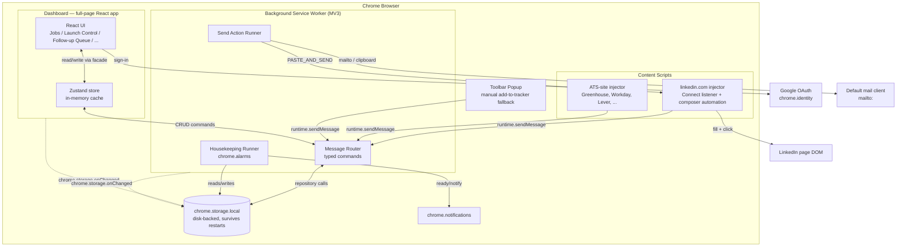
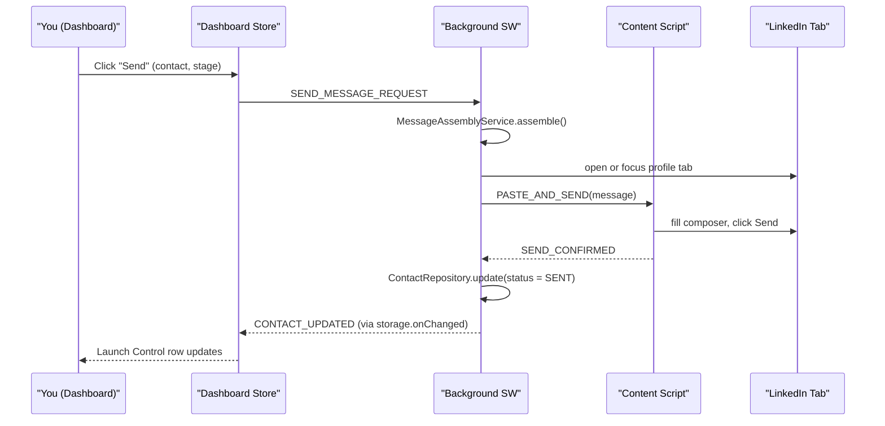

# LinkedIn Referral Outreach Tracker — Technical Design Doc

**Status:** Draft v1
**Last updated:** August 10, 2026
**Builds on:** the PRD (v2) — this doc doesn't restate feature behavior, only how it gets built.
**Ground rule for everything below:** extension-only, full-screen dashboard, no hosted backend right now — but every layer is built so that the dashboard *and* the storage layer can be lifted out into a hosted app later by swapping adapters, not rewriting logic.

---

## Contents
1. [Tech stack](#1-tech-stack)
2. [High-level design](#2-high-level-design)
3. [Low-level design](#3-low-level-design)
4. [File structure — end to end](#4-file-structure--end-to-end)
5. [Path to extraction (future README outline)](#5-path-to-extraction-future-readme-outline)
6. [Testing & tooling](#6-testing--tooling)
7. [Open questions](#7-open-questions)

---

## 1. Tech stack

| Layer | Choice | Why |
|---|---|---|
| Language | TypeScript everywhere (extension, background, content scripts, dashboard) | The PRD's data model is already typed; strict typing is what lets `core` be shared safely across contexts that can't share memory (background / content script / dashboard are separate JS realms). |
| UI framework | React 18 | Component-based, matches "reusable components" requirement directly, huge ecosystem for the table-heavy views (Launch Control, History). |
| Build tool | Vite + **@crxjs/vite-plugin** | CRXJS is the current standard way to build Manifest V3 extensions with Vite — handles manifest generation, HMR for the dashboard/popup during dev, and content-script bundling correctly. Far less config than raw webpack. |
| Styling | Tailwind CSS + CSS variables for design tokens | Utility-first keeps the UI consistent without a bespoke CSS file per component; tokens-as-CSS-variables is what makes "same font, same style everywhere" enforceable in one place (§3.7). |
| Component primitives | Radix UI (unstyled, accessible) + `class-variance-authority` for variants | This is the same pattern shadcn/ui uses — accessible-by-default primitives (focus traps, keyboard nav, ARIA) with your own Tailwind skin on top, rather than pulling in a heavy pre-styled kit like MUI that fights you on custom design. |
| Icons | `lucide-react` | Clean, consistent line-icon set; also what's available in this chat's own artifact tooling, so it's a safe, actively-maintained choice. |
| State management | Zustand | Minimal boilerplate versus Redux, works cleanly as the in-memory cache described in §2.4, and each JS context (dashboard, popup) can own its own store instance without ceremony. |
| Data persistence (v1) | `chrome.storage.local`, accessed only through a repository layer (§3.2–3.4) | Disk-backed by Chrome itself — survives browser/OS restarts (§2.3) — and the repository indirection is *the* mechanism that makes later extraction possible. |
| Background runtime | Manifest V3 service worker | Required for MV3; owns `chrome.alarms`-driven housekeeping and the typed message router. |
| Auth | `chrome.identity` (Google OAuth) | Native to extensions, no backend required to get a signed-in identity — see the honest caveat about what this does and doesn't protect in §3.6 and open question #4. |
| Monorepo tooling | pnpm workspaces | Lets `core` and `ui` be genuinely separate publishable packages that both the extension *and* a future hosted app import unchanged — this is the concrete mechanism behind "extract later with minor tweaks." |
| Testing | Vitest (unit, `core`/`ui`), React Testing Library (components), Playwright (e2e against a loaded unpacked extension) | Standard modern stack, all first-class with Vite. |
| Lint/format | ESLint (typescript-eslint) + Prettier | Baseline hygiene, nothing exotic. |

---

## 2. High-level design

### 2.1 Component overview

Four JS contexts live inside the extension, none of which share memory — they only talk through `chrome.runtime` messaging and `chrome.storage`:

- **Content scripts** — injected into `linkedin.com` and the known ATS domains. Listen for the native Connect click, inject Add-to-Tracker prompts, and (only on an explicit Send command from the background) perform the paste-and-click automation.
- **Background service worker** — the only place business logic runs unattended. Owns the typed message router, the `chrome.alarms`-driven housekeeping pass, and orchestrates the manual-send action.
- **Dashboard** — the full-page React app (`chrome-extension://…/dashboard.html`), opened as a normal tab. This *is* the "full screen mode" you asked for — all PRD dashboard sections live here.
- **Popup** — the small toolbar popup, used only for the manual "add current page to tracker" fallback and a quick status glance.



### 2.2 Data flow — two worked examples

**Manual send (the core write path):**



**Housekeeping (the automatic, read-only path — PRD §12):** on a `chrome.alarms` tick or tab focus, the background worker runs `HousekeepingService.run()`, which reads connections + current contacts from the repositories, computes status transitions (accepted / expired / follow-up due / auto-archive) purely in memory, then writes the diffs back through the same repositories. Nothing in this path ever touches the LinkedIn DOM — it's why it's safe to run unattended (PRD §5, §7.5).

### 2.3 Persistence & durability — not losing data when the computer shuts off

`chrome.storage.local` is written to disk by Chrome itself, under your Chrome profile directory — it survives browser restarts, laptop shutdowns, and OS reboots, as long as the Chrome profile isn't wiped or the extension isn't uninstalled with data clearing. So durability across a normal shutdown is already handled structurally, not something we have to build.

What it *doesn't* give you is redundancy — one corrupted profile or an accidental "clear extension data" click and it's gone, with no hosted backup to fall back to (since there's no backend yet). So Settings gets a **Backup & Restore** feature as cheap insurance:
- **Export** — every repository already exposes `getAll()`; serialize jobs + contacts + settings to one JSON file and trigger `chrome.downloads.download()`.
- **Import** — reverse of the above, with a confirmation step before overwriting.
- Optionally, a weekly auto-export to a dated file in the user's Downloads folder — cheap, and directly solves "what if my laptop dies" better than relying on `chrome.storage.local` alone.

This also happens to be useful later: an export file is the natural seed data for whatever hosted database replaces `chrome.storage.local` if you ever do the extraction in §5.

### 2.4 Caching strategy

No separate cache database is needed at this scale — two tiers cover it:

1. **`chrome.storage.local`** is the source of truth.
2. **The Zustand store in each context** (dashboard, background) is the in-memory cache — read once on load, held in memory, and kept in sync across contexts via `chrome.storage.onChanged`, which acts as a pub/sub channel between processes that otherwise can't see each other's memory. This is the Observer pattern doing real work, not just a buzzword — it's the actual mechanism that makes "dashboard tab open in one window, background worker updating in another" stay consistent.

If the data volume ever gets close to the ~10MB `chrome.storage.local` ceiling (per the PRD's storage note), the migration path is IndexedDB — and because nothing outside `packages/storage-chrome` ever calls `chrome.storage.*` directly (§3.4), that migration touches one package, not the whole app.

---

## 3. Low-level design

### 3.1 Architectural pattern: Ports & Adapters (Hexagonal)

The whole "modular enough to extract later" requirement really comes down to one decision: **business logic never imports `chrome.*` APIs directly.** It only talks to repository *interfaces* defined in `core`. Today, one adapter package (`storage-chrome`) implements those interfaces against `chrome.storage.local`. Later, a different adapter package (`storage-rest`, not built yet) implements the *same interfaces* against a hosted API. The dashboard, the services, the domain types — none of that code changes. That's the "minor tweaks" you asked for; it's not a hope, it's a structural consequence of this one rule.

```
        ┌─────────────────────────────────────────┐
        │              packages/ui                 │   reusable components,
        │        (Button, Card, DataTable, ...)     │   no business logic
        └───────────────────┬───────────────────────┘
                             │ imports
        ┌───────────────────▼───────────────────────┐
        │             packages/core                  │   domain models,
        │  services (Housekeeping, MessageAssembly,   │   repository INTERFACES,
        │   EmailPattern, Scheduling) + repo ports    │   zero chrome/browser deps
        └───────────────────┬───────────────────────┘
                             │ implemented by
              ┌──────────────┴──────────────┐
   ┌──────────▼──────────┐        ┌─────────▼──────────┐
   │ packages/storage-    │        │ packages/storage-   │  (future, §5)
   │ chrome (adapter)     │        │ rest (adapter)       │
   │ → chrome.storage.local│        │ → hosted REST API    │
   └───────────────────────┘        └───────────────────────┘
```

### 3.2 Domain layer (`packages/core/src/domain`)

Field-level definitions are unchanged from PRD §6 — reproduced here at the module level:

```typescript
// domain/models.ts
export interface JobPosting { /* same shape as PRD §6 */ }
export interface Contact { /* same shape as PRD §6, channel-discriminated */ }
export interface GlobalSettings { /* same shape as PRD §6 */ }
export interface UserAccount { /* same shape as PRD §6 */ }
```

```typescript
// domain/repositories.ts — the "ports"
export interface JobRepository {
  getAll(): Promise<JobPosting[]>;
  getById(id: string): Promise<JobPosting | null>;
  create(job: Omit<JobPosting, 'id'>): Promise<JobPosting>;
  update(id: string, patch: Partial<JobPosting>): Promise<JobPosting>;
  delete(id: string): Promise<void>;
  onChange(cb: (jobs: JobPosting[]) => void): Unsubscribe;
}

export interface ContactRepository {
  getAll(): Promise<Contact[]>;
  getByJobId(jobId: string): Promise<Contact[]>;
  create(contact: Omit<Contact, 'id'>): Promise<Contact>;
  update(id: string, patch: Partial<Contact>): Promise<Contact>;
  onChange(cb: (contacts: Contact[]) => void): Unsubscribe;
}

export interface SettingsRepository {
  get(): Promise<GlobalSettings>;
  update(patch: Partial<GlobalSettings>): Promise<GlobalSettings>;
}
```

```typescript
// domain/clock.ts — injectable time source, so services are testable without mocking globals
export interface Clock { now(): Date; }
export class SystemClock implements Clock { now() { return new Date(); } }
```

### 3.3 Service layer (`packages/core/src/services`) — pure business logic

These are the classes that actually encode PRD behavior. Every constructor takes repository *interfaces*, never concrete adapters — that's what keeps this package chrome-free and portable.

```typescript
export class HousekeepingService {
  constructor(
    private jobs: JobRepository,
    private contacts: ContactRepository,
    private settings: SettingsRepository,
    private clock: Clock,
  ) {}
  // implements the algorithm from PRD §12 — expiry, acceptance detection input,
  // follow-up scheduling, auto-archive check
  async run(acceptedLinkedInProfiles: Set<string>): Promise<void> { /* ... */ }
}

export class MessageAssemblyService {
  assembleOutreach(job: JobPosting, contact: Contact, settings: GlobalSettings): { subject?: string; body: string } { /* ... */ }
  resolveFollowUpTemplate(job: JobPosting, settings: GlobalSettings, stage: 'FU1' | 'FU2'): string {
    // Strategy pattern: job override wins, else fall back to the global default — PRD §7.6
  }
}

export class SchedulingService {
  nextValidWindow(date: Date, settings: GlobalSettings): Date { /* rolls forward to next active day + window — PRD §12 */ }
}

export class EmailPatternService {
  generateCandidates(name: NameParts, domain: string): RankedCandidate[] { /* PRD §9.2–9.4 tier logic */ }
}

export class FuzzySearchService {
  searchCompanies(query: string, jobs: JobPosting[]): JobPosting[] { /* company picker in PRD §7.2 */ }
}
```

### 3.4 Adapter layer (`packages/storage-chrome`) — the only package allowed to say `chrome.storage`

```typescript
export class ChromeJobRepository implements JobRepository {
  private readonly KEY = 'jobs:v1';
  async getAll() { const { [this.KEY]: jobs = [] } = await chrome.storage.local.get(this.KEY); return jobs; }
  // create/update/delete: read-modify-write the same key; onChange subscribes to chrome.storage.onChanged
  // and filters to this key before invoking the callback
}
```

Also owns the change-bus wrapper (`changeBus.ts`) that turns `chrome.storage.onChanged` into a typed, per-key observable, and a `migrations/` folder — a `schemaVersion` value stored alongside the data, plus an ordered list of migration functions run on load, so field additions/renames across PRD iterations (there have already been a few) don't require a manual data wipe.

### 3.5 Messaging layer — typed commands (Command pattern)

Background, content scripts, and dashboard talk only in typed messages, never ad-hoc objects:

```typescript
export type ExtensionMessage =
  | { type: 'CONTACT_ADD_REQUEST'; payload: NewContactInput }
  | { type: 'SEND_MESSAGE_REQUEST'; payload: { contactId: string; stage: Stage } }
  | { type: 'PASTE_AND_SEND'; payload: { message: string } }
  | { type: 'SEND_CONFIRMED'; payload: { contactId: string; stage: Stage } }
  | { type: 'HOUSEKEEPING_RUN' }
  | { type: 'CONTACT_UPDATED'; payload: Contact };
```

A single `messageRouter.ts` in the background switches on `message.type`, so adding a new command means adding one union member and one case — not hunting for scattered `sendMessage` calls.

### 3.6 Design patterns used, and why each earns its place

| Pattern | Where | Why it's actually needed here, not just "best practice" |
|---|---|---|
| **Repository** | `core` interfaces + `storage-chrome` impls | The whole extraction story (§3.1) depends on this one. |
| **Adapter** | `ChromeJobRepository` etc. | Same reason — isolates the one chrome-specific dependency. |
| **Observer / Pub-Sub** | `chrome.storage.onChanged`, Zustand subscriptions | The only way to keep background/dashboard/popup in sync without shared memory (§2.4). |
| **Command** | Typed `ExtensionMessage` union + router | Extension messaging is inherently message-passing; typing it as commands makes the background worker's job router exhaustive and refactor-safe. |
| **Strategy** | `resolveFollowUpTemplate` (job override vs. global), `EmailPatternService` tiers | Both are genuinely "pick a rule from a small set based on context" — the textbook case for Strategy. |
| **Facade** | `appService.ts` in the dashboard (below) | UI components should call one clean surface, not wire up repositories + services themselves in every screen. |
| **Factory** | a small `createRepositories(env)` function | Today it always returns the Chrome adapters; later it branches on environment to return REST adapters instead — this is the literal swap point for §5. |

One honest caveat worth flagging here rather than burying: **Google Sign-In without a backend is an identity display, not real access control.** `chrome.identity` can tell the dashboard "you're signed in as X," but there's no server checking anything — whoever has your Chrome profile already has the data in `chrome.storage.local` regardless of what the sign-in screen shows. It's still worth having (matches the PRD requirement, and sets up cleanly for real auth once a backend exists), just want to be upfront that it's a UI nicety in v1, not a security boundary. See open question #4.

### 3.7 UI component library & design language

**Structure** (`packages/ui`) — one shared library the dashboard and popup both import, and the eventual hosted web app would too:

```
packages/ui/src/
  tokens/
    colors.css        (--color-bg, --color-surface, --color-border, --color-text,
                        --color-text-muted, --color-accent, --color-accent-fg,
                        --color-success, --color-warning, --color-danger)
    typography.css     (--font-sans; type scale --text-xs … --text-3xl)
    radius.css          (--radius-sm/md/lg/xl)
  components/
    Button/ Card/ Badge/ StatusPill/ DataTable/ Tabs/ Dialog/
    Toast/ Combobox/ FormField/ EmptyState/ Input/ Select/
  hooks/
    useToast.ts
  index.ts
```

Every component is built on a Radix primitive (for accessibility — focus trapping, keyboard nav, ARIA roles come for free) skinned with Tailwind classes driven entirely by the token CSS variables above, plus `cva` for variants (`<Button variant="primary" size="sm">`). One token file changing updates every component — that's what makes "same font, same style everywhere" an actual guarantee rather than a hope developers remember to honor.

**Design language** — a direct, honest note: I don't have reliable access to Anthropic's actual proprietary font files or design tokens, so I can't literally clone claude.ai's exact typeface. What I'm speccing instead is an equivalent modern, clean, warm aesthetic using open tools, in the same spirit:

- **Type:** `Inter` (variable font, free, excellent at small UI sizes) as `--font-sans`, system-ui fallback stack. Body text ~14px, secondary/muted text ~13px, section headers 20–24px with a tighter line-height.
- **Color:** a warm off-white background rather than stark white, neutral warm grays for borders and muted text, one restrained accent color for primary actions and status (exact hex TBD — see open question #3), soft background-tinted status pills (e.g. a pale green fill for `ACCEPTED`, pale amber for `EXPIRED`) rather than saturated badge colors.
- **Shape & spacing:** 8–12px rounded corners (`--radius-md/lg`), subtle 1px borders as the primary separator instead of heavy drop shadows, consistent 16/24px padding rhythm.
- **Density:** Launch Control and History are data-table-heavy views — comfortable row height, sticky header, monospace treatment for timestamps only, everything else in the sans scale above.

If you can pull the real computed font-family names off claude.ai via devtools (or just have your own brand preference), swap them into `typography.css` directly — one file, no component changes needed.

### 3.8 State management — Zustand stores + a facade

The dashboard doesn't call repositories or services directly from components. One facade wraps all of it:

```typescript
// dashboard/services/appService.ts
export class AppService {
  constructor(
    private jobs: JobRepository,
    private contacts: ContactRepository,
    private settings: SettingsRepository,
    private housekeeping: HousekeepingService,
    private assembly: MessageAssemblyService,
  ) {}
  async sendMessage(contactId: string, stage: Stage) { /* posts SEND_MESSAGE_REQUEST, awaits confirmation */ }
  async addLinkedInContact(input: NewContactInput) { /* ... */ }
  // ...one method per user-facing action in the PRD's user flows
}
```

Zustand stores (`useJobsStore`, `useContactsStore`, `useSettingsStore`) hold the in-memory cache, expose it to components via hooks, and call into `AppService` for mutations — components never see a repository or a `chrome.*` call. This is what keeps `dashboard/routes/**` free of any storage-specific code, so if §5 ever happens, only `appService.ts`'s constructor wiring changes (Chrome repos → REST repos), not a single route component.

### 3.9 Schema versioning & migrations

`storage-chrome` stores a `schemaVersion` number alongside the data. On load, it runs any migration functions between the stored version and the current code's expected version, in order, before anything else reads the data. Given the PRD has already gone through one revision that changed the `Contact` shape (adding `channel`), this isn't hypothetical — it's exactly the kind of change this is for.

---

## 4. File structure — end to end

```
linkedin-referral-tracker/
├── README.md                        # see §5 for what goes in here
├── package.json                     # pnpm workspace root
├── pnpm-workspace.yaml
├── tsconfig.base.json
├── .eslintrc.cjs
├── .prettierrc
│
├── packages/
│   ├── core/                        # pure domain logic — zero browser/chrome deps
│   │   ├── package.json
│   │   └── src/
│   │       ├── domain/
│   │       │   ├── models.ts
│   │       │   └── repositories.ts
│   │       ├── services/
│   │       │   ├── HousekeepingService.ts
│   │       │   ├── MessageAssemblyService.ts
│   │       │   ├── EmailPatternService.ts
│   │       │   ├── SchedulingService.ts
│   │       │   └── FuzzySearchService.ts
│   │       ├── clock/
│   │       │   └── Clock.ts
│   │       └── index.ts
│   │
│   ├── storage-chrome/              # adapters: core's repository interfaces → chrome.storage
│   │   ├── package.json
│   │   └── src/
│   │       ├── ChromeJobRepository.ts
│   │       ├── ChromeContactRepository.ts
│   │       ├── ChromeSettingsRepository.ts
│   │       ├── changeBus.ts
│   │       ├── migrations/
│   │       │   └── 001-add-contact-channel.ts
│   │       └── index.ts
│   │
│   ├── ui/                          # shared, reusable React component library
│   │   ├── package.json
│   │   ├── tailwind.config.ts
│   │   └── src/
│   │       ├── tokens/ (colors.css, typography.css, radius.css)
│   │       ├── components/ (Button/ Card/ Badge/ StatusPill/ DataTable/ Tabs/
│   │       │                Dialog/ Toast/ Combobox/ FormField/ EmptyState/ ...)
│   │       ├── hooks/
│   │       └── index.ts
│   │
│   └── extension/                   # the shippable Chrome extension
│       ├── package.json
│       ├── vite.config.ts           # @crxjs/vite-plugin
│       ├── manifest.config.ts       # MV3 manifest source
│       └── src/
│           ├── background/
│           │   ├── index.ts
│           │   ├── alarms.ts
│           │   ├── housekeepingRunner.ts
│           │   ├── sendActionRunner.ts
│           │   └── messageRouter.ts
│           ├── content-scripts/
│           │   ├── linkedin/
│           │   │   ├── addToTrackerInjector.ts
│           │   │   ├── connectButtonListener.ts
│           │   │   ├── composerAutomation.ts
│           │   │   └── selectors.ts          # single source of truth for DOM selectors
│           │   └── ats/
│           │       ├── atsDetector.ts        # regex table, PRD §8.1
│           │       └── addToTrackerInjector.ts
│           ├── dashboard/                    # the full-screen app
│           │   ├── main.tsx
│           │   ├── App.tsx
│           │   ├── routes/
│           │   │   ├── Jobs/
│           │   │   ├── LaunchControl/
│           │   │   ├── FollowUpQueue/
│           │   │   ├── ReferralReceived/
│           │   │   ├── History/
│           │   │   ├── Settings/
│           │   │   └── EmailFinder/
│           │   ├── store/
│           │   │   ├── useJobsStore.ts
│           │   │   ├── useContactsStore.ts
│           │   │   └── useSettingsStore.ts
│           │   ├── services/
│           │   │   └── appService.ts
│           │   └── index.html
│           ├── popup/
│           │   ├── main.tsx
│           │   └── App.tsx
│           ├── auth/
│           │   └── googleAuth.ts
│           └── icons/
│
├── future/                          # not built — placeholders for the extraction path, §5
│   ├── storage-rest/
│   └── server/
│
└── e2e/
    └── playwright/
```

---

## 5. Path to extraction (future README outline)

You asked for this to live in the plan rather than be written as a standalone file yet — here's what the real `README.md` will say once you're ready to pull the dashboard and storage out into something hosted:

1. **Implement `storage-rest`** — a new adapter package implementing the exact same `JobRepository` / `ContactRepository` / `SettingsRepository` interfaces from `core`, but calling a REST (or tRPC) API instead of `chrome.storage`.
2. **Stand up a minimal backend** — any Node service (Express/Fastify/tRPC) exposing endpoints that mirror the repository methods 1:1, backed by SQLite or Postgres. Because the interfaces already exist, this is largely a mechanical translation.
3. **Swap the wiring, not the app** — in `dashboard/services/appService.ts`, change the `createRepositories(env)` factory (§3.6) to return `storage-rest` instances instead of `storage-chrome` ones. No route or component changes.
4. **Move the dashboard out of the extension bundle** — `dashboard/` becomes its own Vite app (still importing `packages/ui` and `packages/core` unchanged) deployed wherever you host it.
5. **Swap auth** — `chrome.identity` → a standard OAuth 2.0 web flow against the same Google client; this is the one piece that's genuinely different code, not just rewiring, since a hosted app needs a real server-side session.
6. **Extension keeps its job** — content scripts and the background worker still have to live in-browser (DOM automation can't run server-side); they'd call the new hosted API instead of local storage directly for anything the dashboard now owns.
7. **Migrate data** — use the Export feature from §2.3 to seed the new database from your existing local export.

## 6. Testing & tooling

- **`core`** — unit tests (Vitest) for every service, especially `HousekeepingService` (expiry/scheduling edge cases) and `EmailPatternService` (tier generation) — pure functions, no mocking needed beyond a fake `Clock`.
- **`ui`** — component tests (React Testing Library) for interactive components (`Combobox`, `DataTable` sorting/filtering).
- **`extension`** — Playwright driving a real loaded unpacked extension in Chromium for the flows that matter most (add job, add contact, manual send happy path) — see open question #6 on how much of this to build for v1.
- **Lint/format** — ESLint + Prettier on a pre-commit hook (husky + lint-staged), TypeScript `strict: true` everywhere.

## 7. Open questions

1. **Stack sign-off** — React + TypeScript + Vite/CRXJS + Tailwind + Zustand + Radix/shadcn-style components + pnpm monorepo. Any of these you'd rather swap (existing familiarity with something else, or a reason to avoid Tailwind specifically)?
2. **Monorepo vs. flat repo** — pnpm workspaces add real structure for a solo project. Comfortable starting there, or would you rather begin as one flat package and split into `core`/`ui`/`storage-chrome` once it actually needs splitting?
3. **Design tokens** — I don't have access to Anthropic's real font/color tokens, so §3.7 specs a placeholder (Inter + warm neutrals + one accent TBD). Fine to build against that placeholder now and refine later, or do you want to lock exact colors/fonts before any components get built?
4. **Google Sign-In scope** — as noted in §3.6, without a backend it's identity display only, not real access control. Still want it built for v1 on that understanding, or hold off until there's something server-side to actually check against?
5. **Backup cadence** — manual Export/Import button in Settings is the baseline (§2.3). Want an automatic weekly backup download too, or is on-demand enough for now?
6. **Testing depth for v1** — unit tests on `core` plus light component tests, or do you want the full Playwright e2e suite (loaded extension, real automation flows) built from the start?
7. **Visual pass first?** — want a rough wireframe/mockup pass before component implementation starts, or go straight from this doc into building `packages/ui`?
